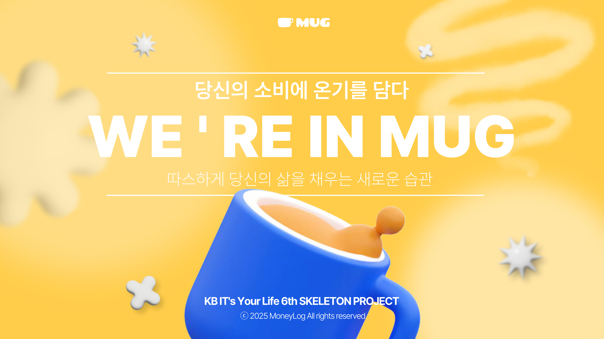

## <span id="header">MUG(MoneyloG)☕️</span>

<hr style="border: none; height: 1px; background-color: #ddd;" />

## 

<hr style="border: none; height: 1px; background-color: #ddd;" />

#### [목차]

1.  [소개 및 개요](#outline)
2.  [프로젝트 설명](#aboutPjt)
3.  [팀원 소개 및 역할 분담](#aboutUs)
4.  [사용 기술](#Techused)
5.  [핵심 기능](#prmyFunc)
6.  [화면 설계](#dsgnBrd)
7.  [프로젝트 구조](#structure)
8.  [구현 결과](#results)
9.  [프로젝트 후기](#comment)

<hr style="border: none; height: 1px; background-color: #ddd;" />

#### <span id="outline">[소개 및 개요]</span>

- KB IT's Your Life 스켈레톤 프로젝트
- 프로젝트 기간: 2025.04.07 ~ 2025.04.10
- 배포 URL:

<hr style="border: none; height: 1px; background-color: #ddd;" />

#### <span id="aboutPjt">[프로젝트 설명]</span>

- '머니로그(머그)'는 **수입과 지출을 기록할 수 있는 가계부 플랫폼**입니다.
- 수입과 소비를 아우르는 머니와, 기록을 나타내는 로그를 결합하여, 일상에서의 돈의 흐름을 기록한다는 의미를 담고 있습니다.
- **일상 속에서 자연스럽고 편하게 소비를 기록**할 수 있는 가계부를 목표로 하여 범용성을 높였습니다
- **20대 대상 가계부**
  - 첫 자취나 독립 등으로 지출 관리 경험이 부족한 이들을 위해 지출 습관 파악과 소비 패턴 교정을 위한 가계부
  - 복잡한 엑셀이나 기존 가계부 앱은 기능이 많아서 귀찮거나 부담스러운 이들을 위한 간편한 UI를 구성을 갖춘 가계부

<hr style="border: none; height: 1px; background-color: #ddd;" />

#### <span id="aboutUs">[팀원 소개 및 역할 분담]</span>

- 강경림: 메인 대시보드 전반
- 문시윤: 상세 페이지 전반
- 박정열: 모달창, 상세페이지 및 마이페이지 설정 데이터 바인딩
- 배영현: 캘린더 구현, 전체 페이지 라우팅, 거래내역, 유저, 목표 스토어 상태관리, 거래내역 삭제 구현, 리스트 필터링
- 이동진: 거래 내역 조회 페이지 전반
- 장혜주: 거래 내역 조회 페이지 전반

<hr style="border: none; height: 1px; background-color: #ddd;" />

#### <span id="Techused">[사용 기술]</span>

 HTML5
 CSS3
 JavaScript
 Node
 Vue
 Json

<hr style="border: none; height: 1px; background-color: #ddd;" />

#### <span id="prmyFunc">[핵심 기능]</span>

- 수입/지출 기록
  - 세부 정보(날짜, 금액, 카테고리, 메모) 입력하여 기록 (모든 페이지에서 작동 가능하도록 오른쪽 하단에 +버튼 구현)
- 거래 내역 조회
  - 필터 기능을 통해 특정 조건(월, 카테고리, 수입, 지출)에 맞는 거래 내역 조회
- 월별 재정 요약
  - 캘린더를 통해 날짜별 수입, 지출 표시
  - 도넛 차트를 통해 한 달 지출 목표 금액 대비 현재 지출 표시
  - 이번 달 수입 - 이번 달 지출 = 현재 금액 표시
  - 이번 달 지출이 많은 카테고리에 따른 소비 분석 리포트를 통해 별칭 지정
- 데이터 저장
  - 데이터는 모두 json-server에 저장

<hr style="border: none; height: 1px; background-color: #ddd;" />

#### <span id="dsgnBrd">[화면 설계]</span>

###### 1. 대시보드 페이지

###### 2. 거래 내역 조회 페이지

- 월 필터링, 카테고리 필터링, 수입/지출 필터링
- 이번 달 총 수입과 총 지출 표시
- 모달 창에서 입력한 내역 표시

###### 3. 거래 내역 상세 페이지

- 해당 소비/지출에 따른 날짜, 금액, 카테고리, 메모 띄움

###### 4. 마이 페이지

- 유저 정보 (닉네임)
- 이번 달 지출 목표 금액 설정
- 유저의 머니로그에 따른 소비 분석 리포트

###### 5. 거래내역 입력 모달 창

- 어떤 페이지에서도 작동 가능
- 소비/지출한 날짜, 금액, 카테고리, 메모 입력

###### 6. 거래내역 수정 모달 창

- 어떤 페이지에서도 작동 가능
- 소비/지출한 날짜, 금액, 카테고리, 메모 입력

<hr style="border: none; height: 1px; background-color: #ddd;" />

#### <span id="structure">[프로젝트 구조]</span>

###### 1. 컴포넌트 설계

- 대시보드 페이지
  - Calender.vue: 월별 캘린더를 렌더링하여 날짜별 금액 확인 제공
  - DonutChart.vue: 수입/지출 비율을 도넛 차트로 시각화
  - GoalTracker.vue: 사용자의 목표 예산과 현재 소비 상태를 시각화
  - IEComparing.vue: 수입과 지출을 비교 시각화
  - MostSpent.vue: 가장 지출이 많았던 항목을 요약하여 보여 줌
- 거래 내역 조회 페이지
  - ListFilter.vue: 상단바 구현, 날짜, 카테고리, 수입, 지출 필터링
- 거래 내역 상세 페이지
  - DetailBackground.vue: 상세페이지에서 배경 정보 표시
  - DetailCenter.vue: 상세페이지의 중앙 정보 영역을 구성
- 마이 페이지
  - MoneyLog.vue: 입력된 거래내역 리포트를 보여 줌
- 거래내역 입력 모달창
  - FloatingButton.vue: 사용자가 새 항목을 입력할 수 있게 함
  - MoneyInputModal.vue: 새 거래내역 입력을 위한 모달창 UI
- 거래내역 수정 모달창
  - FloatingButton.vue: 사용자가 항목을 수정할 수 있도록 함
  - MoneyInputModal.vue: 거래내역 수정을 위한 모달창 UI

<br />

###### 2. DB 설계

- endpoint

  - 게시판 생성 /api/board
  - 댓글(처방전)생성 /api/prescription
  - 게시판 수정 /api/board/{boardId}
  - 게시판 삭제 /api/board/{boardId}
  - 사용자 정보 /user
  - 월별 정보 가져오기 /transactions
  - 소비 카테고리 /transactions
  - 월 요약정보 /transactions
  - 목표 달성율 /goal

- db.json

```{
  "user": {
    "id": 1,
    "nickname": "기타치는 사자",
    "icon": "👨‍💻"
  },
  "log": {
    "userId": 1,
    "userLog": [
      {
        "id": 1,
        "title": "쇼핑왕",
        "description": "이번 한 달 동안 쇼핑에 가장 많이 소비했어요",
        "icon": "shopping"
      },
      {
        "id": 2,
        "title": "출석왕",
        "description": "이번 한 달 동안 매일 가계부를 작성했어요",
        "icon": "trophy"
      },
      {
        "id": 3,
        "title": "소비왕",
        "description": "이번 한 달 동안 수입보다 소비 금액이 컸어요",
        "icon": "money"
      }
    ]
  },
  "goal": {
    "month": "2025-04",
    "currentExpense": 100000,
    "targetExpense": 500000
  },
  "transactions": [
    {
      "id": 1,
      "type": "expense",
      "category": "술-유흥",
      "code": "drink",
      "content": "편의점",
      "date": "2025-01-10",
      "amount": 73158
    },
    {
      "id": 2,
      "type": "income",
      "category": "계좌이체",
      "code": "atm",
      "content": "세뱃돈",
      "date": "2025-01-25",
      "amount": 7856
    },
    {
      "id": 3,
      "type": "expense",
      "category": "술-유흥",
      "code": "drink",
      "content": "옷 구매",
      "date": "2025-01-13",
      "amount": 151692
    },
    {
      "id": 4,
      "type": "income",
      "category": "계좌이체",
      "code": "atm",
      "content": "부모님",
      "date": "2025-01-17",
      "amount": 54487
    },
    {
      "id": 5,
      "type": "expense",
      "category": "보험-세금",
      "code": "tax",
      "content": "이마트",
      "date": "2025-01-24",
      "amount": 43713
    },
    {
      "id": 6,
      "type": "expense",
      "category": "술-유흥",
      "code": "drink",
      "content": "점심 식사",
      "date": "2025-02-27",
      "amount": 99711
    },
    {
      "id": 7,
      "type": "income",
      "category": "용돈",
      "code": "money",
      "content": "급여",
      "date": "2025-02-16",
      "amount": 14600
    },
    <!-- 생략 -->
  ],
  "categories": [
    {
      "id": 1,
      "name": "식비",
      "code": "eat"
    },
    {
      "id": 2,
      "name": "편의점-마트-잡화",
      "code": "market"
    },
    {
      "id": 3,
      "name": "용돈",
      "code": "money"
    },
    {
      "id": 4,
      "name": "쇼핑",
      "code": "shopping"
    },
    {
      "id": 5,
      "name": "술-유흥",
      "code": "drink"
    },
    {
      "id": 6,
      "name": "카페-간식",
      "code": "cafe"
    },
    {
      "id": 7,
      "name": "의료-건강",
      "code": "medical"
    },
    <!-- 생략 -->
  ],
  "theme": "light"
}
```

<hr style="border: none; height: 1px; background-color: #ddd;" />

#### <span id="results">[구현 결과]</span>

<!-- 구현 완료 후 사진 따와서 삽입 -->

<hr style="border: none; height: 1px; background-color: #ddd;" />

#### <span id="comment">[프로젝트 후기]</span>

##### 🐱 경림

<pre> 💭 이번 프로젝트를 하면서 잘 와닿지 않았던 이론적인 개념들을 이해할 수 있게 되었어요! <br /> 또 프론트엔드 기술 뿐만 아니라, 프로젝트의 전반적인 흐름과 진행 방식을 배울 수 있었고,<br /> 특히 깃^^에 대해 많이 알아갈 수 있었던 것 같습니다 ㅋㅋㅠㅠ <br /> 많이 부족한 제가 열정 가득한 좋은 팀원 분들을 만나서 저도 함께 더 열심히 할 수 있었던 것 같아요 <br /> 조원 분들게 도움도 많이 받고.. 질문도 많이 하고… 또 의도한대로 결과물을 내게 되어 너무 감사한 마음이에요 🥹 <br /> 모든 점에서 너무나도 유익하고 소중한 시간이었습니다! 머니로그조 감사하고 너무 고생하셨어요 ㅠㅠ♥️ </pre>

##### 🐼 시윤

<pre> 💭 많이 헤매고 어려워했지만 이번 프로젝트 통해서 더 배울 수 있었던 것 같아요. <br /> 프로젝트 하기 전부터 제가 잘 해낼 수 있을지 걱정했는데 좋은 팀원 분들을 만나서 너무 많이 도와주시고 알려주셔서 죄송하고 감사했습니다..! <br />그리고 무엇보다 많이 부족한 걸 훅 체감할 수 있었던 것 같아요. 열심히 공부해봐야겠습니다. <br />이번 주는 정말 빠르게 시간이 지나간 것처럼 느껴지네요.. 다들 정말 감사했습니다!!! </pre>

##### 🦁 정열

<pre> 💭 팀을 꾸려 작업을 하는게 처음엔 잘 할 수 있을까하는 걱정이 많이 되었습니다. 하지만 하루가 지날 때마다 놀라울 만큼 빠르게 멋진<br /> 기능들이 구현되는 모습을 보고, 매일매일 성취감을 얻는 경험을 하였습니다. 무엇보다도 믿음직한 팀원들 덕분에 더더욱 용기내서<br /> 개발할 수 있었습니다. 머니로그 팀원들 정말<br /> 고생 많으셨어요!!😄 </pre>

##### 🐹 영현

<pre> 💭 처음 vue를 배워봤는데, 짧은 시간 안에 계획했던 기능들을 다 구현할 수 있었어서 뿌듯했습니다. <br/> 그리고, 팀원분들께서 적극적으로 역할 분담도 해주시고 다같이 으쌰으쌰하면서 해서 저도 더 열심히하게 된 것 같아요!! <br/> 다음에 기회가 된다면, v1.1로 리팩터링도 해보고 싶습니다. 우리 머니로그조 5일 동안 고생 많으셨어요🥰 </pre>

##### 🐶 동진

<pre> 💭  강의를 통해 들었던 걸 실제로 프로젝트로 경험해보면서 몸으로 많이 부딪히면서 배울 수 있었고, 그 과정에서 정말 많이 배워간 것 같습니다. 과정이 쉽지는 않았고 아직 배울게 많다고 느껴저서 앞으로 혼자서 더 많이 연습해볼 계획입니다. 제가 처음인 부분이 많아서 팀원 분들의 도움을 많이 받고 제가 기여한 부분이 많지가 않아서 죄송하고 감사했습니다..ㅜㅜ 좋은 팀원 분들을 만나서 더욱 값진 경험이 된 것 같습니다. :) </pre>

##### 🐰 혜주

<pre> 💭  어려운 부분도 있었지만, 팀원분들과 함께 프로젝트를 진행하면서 정말 많은 걸 배우고 새롭게 알게 된 시간이었어요! 오류도 겪어보고 고쳐보면서 더 깊이 이해할 수 있었고, 덕분에 실력도 조금씩 늘어난 것 같아요. 실행이 잘 되는 걸 보니까 신기하고, 결과 화면을 보니 정말 뿌듯했어요. 다들 고생 많으셨습니다!! </pre>

<hr style="border: none; height: 1px; background-color: #ddd;" />

## 
